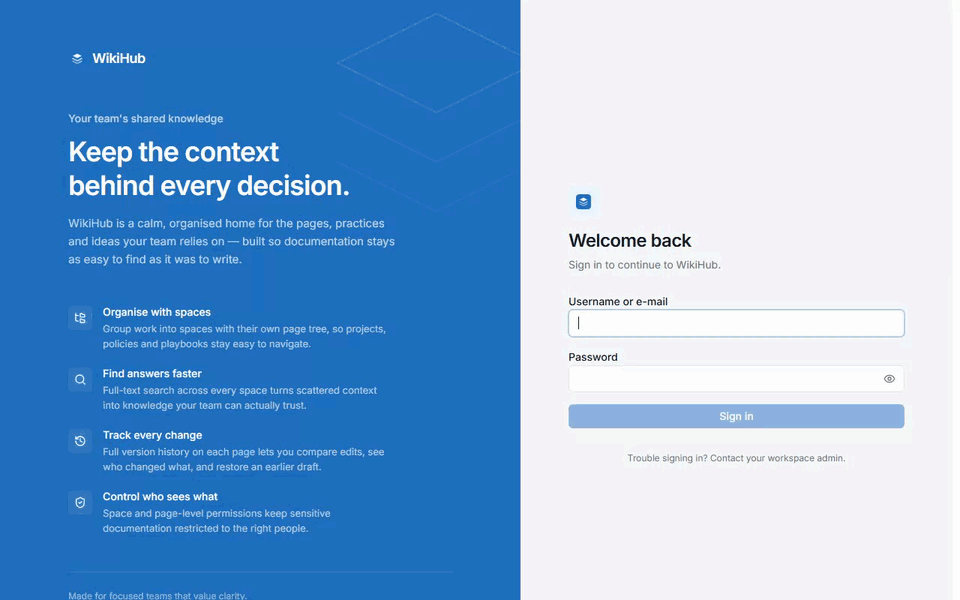
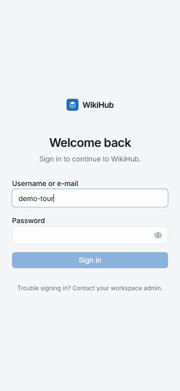

<div align="center">


# WikiHub

**The open-source, self-hosted alternative to Confluence and Notion**

No per-seat pricing, no vendor lock-in — Spaces, hierarchical Pages, a rich
editor with full revision history, attachments, search, one-command
Confluence migration, and Markdown/HTML/Word export, all on infrastructure
you control. Built as a **modular monolith**, deployable with one command via
Docker Compose.

If WikiHub is useful to you, a ⭐ on the repo helps other teams find it.

[](https://github.com/QuanBlue/wiki-hub/graphs/contributors)
[](https://github.com/QuanBlue/wiki-hub/commits/master)
[](https://github.com/QuanBlue/wiki-hub/network/members)
[](https://github.com/QuanBlue/wiki-hub/stargazers)
[](https://github.com/QuanBlue/wiki-hub/issues)
[](#-license)

**[Demo](#-demo) • [Documentation](#-documentation) • [Report Bug](https://github.com/QuanBlue/wiki-hub/issues) • [Request Feature](https://github.com/QuanBlue/wiki-hub/issues)**

> **Status: the core platform is built and in daily use** — Spaces, Pages, full
> revision history, authentication & RBAC, the rich editor, attachments,
> search, and Confluence import/export are all shipped. See
> [Roadmap](#-roadmap) for what's still open.

</div>

---

## 📖 Table of Contents

- [WikiHub](#wikihub)
  - [📖 Table of Contents](#-table-of-contents)
  - [🎯 Why WikiHub?](#-why-wikihub)
  - [📽️ Demo](#️-demo)
  - [⭐ Key Features](#-key-features)
  - [🏗️ Architecture](#️-architecture)
  - [🧰 Tech Stack](#-tech-stack)
  - [🛠️ Getting Started](#️-getting-started)
    - [📌 Prerequisites](#-prerequisites)
    - [🔑 Quick Start (Docker)](#-quick-start-docker)
    - [🚦 Port Conflicts](#-port-conflicts)
    - [⚙️ Local Development (without Docker)](#️-local-development-without-docker)
  - [🧬 Database Migrations](#-database-migrations)
  - [🧪 Tests](#-tests)
  - [📥 Importing from Confluence](#-importing-from-confluence)
  - [📤 Exporting](#-exporting)
  - [🚢 Deployment](#-deployment)
  - [🔒 Security](#-security)
    - [🕵️ Account Switching (Impersonation)](#️-account-switching-impersonation)
  - [🗺️ Roadmap](#️-roadmap)
  - [📚 Documentation](#-documentation)
  - [✨ Credits](#-credits)
  - [📜 License](#-license)

## 🎯 Why WikiHub?

| | WikiHub | Confluence | Notion |
|---|:---:|:---:|:---:|
| Self-hosted | ✅ always | Data Center only, paid | ❌ |
| Open source | ✅ Apache-2.0 | ❌ | ❌ |
| Per-seat pricing | ❌ free | ✅ | ✅ |
| Your data stays on your infrastructure | ✅ | Data Center only | ❌ |
| One-command migration from Confluence | ✅ | — | ❌ |
| Full revision history & restore | ✅ | ✅ | ✅ |
| Space/page-level permissions | ✅ | ✅ | Limited |

WikiHub exists for teams who want Confluence-style documentation — Spaces,
nested Pages, a rich editor, permissions — without a per-seat bill or their
knowledge base living on someone else's servers. Migrating off Confluence is
a first-class flow, not an afterthought: point WikiHub at a real Confluence
XML or HTML export and it comes in as actual Spaces and Pages, not a wall of
unformatted text.

## 📽️ Demo

<div align="center">



<sub>Sign in → Home → space → page → edit with the <code>/</code> slash menu → save, end to end.</sub>

<br>



<sub>The same flow at phone width — see <a href="docs/demo#small-screens">docs/demo</a> for details.</sub>

**Full walkthrough with screenshots of every feature: [`docs/demo`](docs/demo).**

</div>

## ⭐ Key Features

- **Spaces & hierarchical pages** — per-team knowledge containers with nested page
  trees, drag-anywhere moves, and per-user/per-group permissions down to a single
  page.
- **Rich-text editor** — Tiptap-based WYSIWYG with a sticky toolbar, `/` slash
  commands, tables, code blocks, callouts, toggles, and a raw Markdown/HTML source
  mode you can switch into at any time.
- **Full revision history** — every save is an immutable snapshot with a visual
  diff and one-click restore that never destroys later history.
- **Attachments & Office editing** — images, video (with subtitles, audio tracks,
  and Picture-in-Picture), PDFs, and in-place editing of Word/Excel/PowerPoint via
  an embedded ONLYOFFICE Document Server.
- **Confluence import & export** — import a Confluence XML or HTML space export
  with a live progress report, or export to Confluence Data Center's own XML
  format for a one-way hand-off.
- **Export to Markdown/HTML/Word** — a single page, a subtree, a Space, or the
  whole instance, packaged as an offline-browsable ZIP.
- **Fine-grained access control** — Open or Restricted spaces, per-user/per-group
  permission grants, page-level allow-lists, and an Effective Permissions view
  that resolves exactly what any one person can do.
- **Full-text search** — one `Ctrl`/`⌘`+`K` search across every space and page you
  have permission to see.
- **Theming & branding** — curated color palettes or a custom hex color, logo
  presets or a custom upload, and a live preview before anything goes live.
- **English & Vietnamese UI** — a top-bar language switch translates the whole
  interface instantly, no reload; the choice is remembered per browser.
- **Admin backup & restore** — scheduled, resumable WikiHub backups with password
  hash handling called out explicitly, plus safety checks against uploading the
  wrong archive type.

## 🏗️ Architecture

```
Browser
   │
   ▼
Next.js 16 (App Router)          ── React Server Components for reads,
   │                                client components for the editor
   │  REST /api/v1
   ▼
FastAPI modular monolith         ── Router → Service → Repository → DB
   │
   ├──▶ PostgreSQL 16   application data + full-text search
   ├──▶ Redis 7         job queue, rate limits, short-lived cache
   └──▶ S3 / MinIO      attachments and export packages
              ▲
   arq worker ┘         same image, different entrypoint
```

Business logic lives in **services**, never in route handlers. SQLAlchemy models
never cross the API boundary — every response is a Pydantic schema.

Detailed design: [`docs/architecture.md`](docs/architecture.md).

## 🧰 Tech Stack

| Layer | Choice |
|---|---|
| Backend | Python 3.12, FastAPI, Pydantic v2, SQLAlchemy 2 (async), Alembic |
| Frontend | Next.js 16 (App Router), React 19, TypeScript, Tailwind v4, Tiptap 3 |
| Data | PostgreSQL 16, Redis 7 |
| Objects | S3-compatible (MinIO locally, AWS S3 or equivalent in production) |
| Jobs | arq (asyncio Redis queue) |
| Auth | Local email/password (Argon2id + JWT); OIDC behind an interface |
| Search | PostgreSQL full-text search behind a swappable backend interface |
| Deploy | Docker Compose (`./scripts/run.sh`); Kubernetes/Helm not written yet |

## 🛠️ Getting Started

### 📌 Prerequisites

- Docker 24+ and Docker Compose v2
- For running outside containers: Python 3.12+ and Node.js 20+

### 🔑 Quick Start (Docker)

```bash
./scripts/run.sh --dev   # day-to-day development — hot reload
./scripts/run.sh         # production-like run — built images, no reload
```

`scripts/run.sh` is the one-command way to stand up the whole stack: it creates
`.env` from `.env.example` on first run (an existing `.env` is never
overwritten), resolves host-port conflicts automatically, builds and starts
every service, waits for each one to report healthy (dumping its last 40 log
lines instead of hanging if it doesn't), applies Alembic migrations, seeds the
protected bootstrap admin account, and prints the URLs below. It's idempotent —
running it again only reconciles what has drifted.

| Flag | Effect |
|---|---|
| `--dev` | Hot reload: mounts `backend/`/`frontend/` and runs `uvicorn --reload`, `arq --watch`, `next dev` |
| `--fresh` | `docker compose down -v` and wipes bind-mounted data — **destroys the database, Redis, attachments and automated backups** |
| `--rebuild` | Rebuild images from scratch (`--no-cache`) — needed after a dependency change |
| `--no-build` | Skip building and reuse existing images — fastest way back up when nothing changed |
| `--logs` | Tail logs once everything is healthy |
| `--stop` | Stop the stack (volumes are kept) |
| `--timeout <sec>` | How long to wait for health checks (default 240) |

`./scripts/run.sh --help` prints the same reference, plus common workflows
(first run, after adding a dependency, resetting a broken database, ...).

#### 🧩 The three compose files

Prefer to drive Docker Compose yourself? Start with `cp .env.example .env`
(every file below reads the same `.env`), then pick one — you just lose the
health-wait, automatic port resolution, and auto-seeding that `run.sh` gives
you for free.

| File | Use it for | Where images come from | Source code |
|---|---|---|---|
| [`docker-compose.yml`](docker-compose.yml) | Production-like run on the machine that holds the repo (what plain `./scripts/run.sh` uses) | Built locally from `deploy/docker/` | `./backend` is bind-mounted over the image, so it needs the checkout |
| [`docker-compose.dev.yml`](docker-compose.dev.yml) | Day-to-day development with hot reload (what `./scripts/run.sh --dev` uses) | Built locally, frontend uses the `dev` stage | `backend/` and `frontend/` bind-mounted; edits apply without a rebuild |
| [`docker-compose.release.yml`](docker-compose.release.yml) | Any other server: pull and run | Pulled from GHCR, built by CI ([details](#prebuilt-images-no-build-on-the-server)) | None — copy only this file and `.env` |

`docker-compose.dev.yml` is an **overlay**: it only overrides the base file, so
it is never used alone — and it is deliberately not named
`docker-compose.override.yml`, which Compose would auto-load and silently turn
every plain `docker compose up` into a development run. `release` is
**standalone**: never combine it with the other two.

```bash
# docker-compose.yml — production-like, built from source
docker compose up -d --build
docker compose down                      # stop (add -v to also drop volumes)

# docker-compose.yml + docker-compose.dev.yml — development, hot reload
docker compose -f docker-compose.yml -f docker-compose.dev.yml up -d --build
docker compose -f docker-compose.yml -f docker-compose.dev.yml down

# docker-compose.release.yml — prebuilt images, e.g. on a server
docker compose -f docker-compose.release.yml pull
docker compose -f docker-compose.release.yml up -d
docker compose -f docker-compose.release.yml down
```

All three share the project name `wikihub` and the same data directory
(`WIKIHUB_DATA_HOST_DIRECTORY`), so they are alternatives, not side-by-side
stacks: running `up` with a different file recreates the affected services in
place (as `run.sh` does when you switch `--dev` on or off), and your data
survives the switch. Use the same `-f` files for `down` as you did for `up`.

| Service | URL |
|---|---|
| Frontend | http://localhost:3000 |
| API docs (Swagger) | http://localhost:8000/docs |
| API docs (ReDoc) | http://localhost:8000/redoc |
| Health / readiness | http://localhost:8000/health · `/ready` |
| MinIO console | http://localhost:9001 |

### 🚦 Port Conflicts

`./scripts/run.sh` resolves host-port conflicts on its own, reusing whatever
port it already picked on a restart. Running Docker Compose directly instead,
if something already owns 3000/5432/6379/8000/9000 on your machine, change the
`*_PORT_HOST` values in `.env`. Only the host-side mapping moves; containers keep
talking to each other on standard ports. Browser API requests use the current
WikiHub origin and are proxied by Next.js, so this also works when the frontend
is opened through a reverse proxy or an ngrok URL. `API_INTERNAL_BASE_URL` is
the only URL used for server-side requests inside Docker.

### ⚙️ Local Development (without Docker)

Run the infrastructure in Docker and the app on your machine for fast reloads:

```bash
make deps              # postgres + redis + minio only
make install           # backend virtualenv
make install-frontend  # npm install

make dev-backend       # http://localhost:8000
make dev-worker        # background job worker
make dev-frontend      # http://localhost:3000
```

Run `make help` to see every target.

## 🧬 Database Migrations

Schema is owned entirely by Alembic — tables are never created by hand, and a
fresh database is built purely from migrations.

```bash
make migrate                        # apply all migrations (in Docker)
make migrate-local                  # apply from the host virtualenv
make migration m="add page labels"  # autogenerate a new revision
make downgrade                      # roll back one revision
make seed                           # bootstrap admin user + demo content
```

## 🧪 Tests

```bash
./scripts/test.sh    # every suite + coverage summary  (also: make test-all)
./scripts/test.sh --unit    # fast pass, no database needed
./scripts/test.sh --open    # coverage + open the HTML reports
```

`./scripts/test.sh --help` lists the rest (`--backend`, `--frontend`,
`--watch`, `--fail-under N`, `-k EXPR`). Individual gates:

```bash
make test            # backend: pytest
make test-frontend   # frontend: vitest
make e2e             # end-to-end: Playwright
make lint            # ruff + eslint + prettier
make typecheck       # mypy + tsc
make check           # everything above
```

Tests marked `integration` need PostgreSQL, Redis and MinIO; start them with
`make deps`. `scripts/test.sh` then wires them up automatically against a
separate `wikihub_test` database, so test rows never reach your development
data. Without a database those tests skip themselves and coverage drops from
~81% to ~64% — the script warns when that happens, so the number is never
quietly wrong.

## 📥 Importing from Confluence

WikiHub imports Confluence space exports and detects the format automatically:

- **XML space export** (`entities.xml` + `attachments/`) — richest fidelity:
  page IDs, hierarchy, labels, authors and timestamps.
- **HTML export** (`index.html` + per-page HTML) — hierarchy is recovered from
  breadcrumbs; metadata that the format does not carry is reported as missing.

Imports run as background jobs with live progress and produce a downloadable
report listing every unsupported macro and failed attachment. Nothing is
discarded silently — unrecognised macros become visible callouts in the page.

A dedicated `docs/import-confluence.md` guide is not written yet — see the
in-app **Help** center for day-to-day usage.

## 📤 Exporting

Export a single page, a page subtree, a whole Space or the entire instance to
**Markdown** or **HTML**, packaged as a ZIP with assets and rewritten relative
links so the archive works offline.

A dedicated `docs/export.md` guide is not written yet — see the in-app
**Help** center for day-to-day usage.

## 🚢 Deployment

Production Dockerfiles live in [`deploy/docker/`](deploy/docker) and run as a
non-root user with the Python packaging toolchain stripped out of the runtime
image. Kubernetes manifests and a Helm chart are on the roadmap but not
written yet — see [Roadmap](#-roadmap).

A dedicated `docs/deployment.md` guide is not written yet either; until then,
`./scripts/run.sh` (see [Getting Started](#-getting-started)) is the
supported way to run WikiHub on the machine that holds the source.

### Prebuilt images (no build on the server)

Every push to `master` runs
[`.github/workflows/release-images.yml`](.github/workflows/release-images.yml),
which builds the backend and frontend images and publishes them to GitHub
Container Registry as `ghcr.io/quanblue/wiki-hub-backend` and
`ghcr.io/quanblue/wiki-hub-frontend`, tagged `latest` and `sha-<commit>`
(pushing a `vX.Y.Z` tag also publishes `X.Y.Z` and `X.Y`). The images are
`linux/amd64` only.

On any other server, copy just
[`docker-compose.release.yml`](docker-compose.release.yml) and a `.env` (from
[`.env.example`](.env.example)) — no source checkout. The other two compose
files are described under [The three compose files](#-the-three-compose-files);
`docker-compose.yml` is not suitable here because it needs the source tree:

```bash
docker compose -f docker-compose.release.yml pull
docker compose -f docker-compose.release.yml up -d
```

Repeat the same two commands to update. In `.env`, set
`NEXT_PUBLIC_ONLYOFFICE_DOCUMENT_SERVER_URL` to the address your *browser* uses
for the Document Server (e.g. `http://203.0.113.10:8080`), `WIKIHUB_CORS_ORIGINS`
to the address people open WikiHub at, `WIKIHUB_ENV=production`, and real
secrets. `WIKIHUB_IMAGE_TAG` pins a version (`sha-<commit>` or `1.2.0`) instead
of following `latest`.

Packages published from a private repository are private: either run
`docker login ghcr.io` on the server with a token that has `read:packages`, or
make the two packages public under the repository's *Packages* settings.

## 🔒 Security

- Secrets come from environment variables only; nothing sensitive is committed.
- Passwords hashed with Argon2id; short-lived JWT access tokens plus rotating
  refresh tokens.
- Uploads validated by extension, MIME type **and** magic bytes, with a size cap
  and generated object keys — the original filename is never trusted.
- Structured logs pass through a redaction filter, so passwords, tokens, keys
  and cookies never reach a log sink.
- Security headers and a strict CSP on every API response.

### 🕵️ Account Switching (Impersonation)

Administrators can view WikiHub as another user from the account menu, without
knowing that user's password. The rules:

- **Administrators only**, and never the protected bootstrap account — that one
  is the guaranteed way back into the instance.
- Deactivated accounts cannot be impersonated, and impersonation cannot be
  nested.
- The administrator's identity travels in the signed token's `act` claim, so it
  cannot be stripped without invalidating the signature.
- Starting and stopping are both audited, and **every action taken meanwhile
  records the administrator behind it** (`impersonator_username` in
  `audit_logs`, shown as a `via <admin>` badge in the audit log). Without that
  column the trail would read "alice deleted the space" when an administrator
  did it as alice.
- A non-dismissible banner stays on screen for the whole session.

## 🗺️ Roadmap

The original phase-by-phase build-out is done in substance: the data model and
migrations, Spaces/Pages/Revisions, authentication & RBAC, the Tiptap editor,
attachments, full-text search, the Confluence import/export framework,
background jobs, and the admin UI/security hardening described throughout
this README are all shipped and in daily use — not just planned.

What's genuinely still open:

| Item | Status |
|---|---|
| Page comments | Not built |
| In-app audit log viewer | Not built — admin actions are already logged server-side, there is just no UI to browse that log yet |
| CI pipeline | Not set up — `make check` runs everything a CI job would, just not automatically on push |
| Kubernetes manifests / Helm chart | Not written — only the Dockerfiles in [`deploy/docker/`](deploy/docker) exist today |
| `docs/import-confluence.md`, `docs/export.md`, `docs/deployment.md`, `docs/database.md`, `docs/api.md`, `docs/authentication.md`, `docs/permissions.md` | Not written yet |
| E-mail notifications (password changes, access requests, deactivation) | Planned |
| AI-assisted search & authoring (RAG Q&A, hybrid semantic search, auto-summarization, a Tiptap writing assistant, auto-tagging, stale-content detection) | Proposed — see [`TODO`](TODO) |

The live, actively-worked list — including whatever is in progress right
now — is [`TODO`](TODO).

## 📚 Documentation

| Document | Contents |
|---|---|
| [`docs/demo/`](docs/demo) | Full feature tour with screenshots and a demo GIF |
| [`docs/architecture.md`](docs/architecture.md) | System design and module layout |
| [`docs/development.md`](docs/development.md) | Day-to-day workflow and conventions |
| [`docs/design-system.md`](docs/design-system.md) | Visual language and layout tokens |
| [`docs/user-guide.md`](docs/user-guide.md) | Hướng dẫn sử dụng WikiHub bằng tiếng Việt |
| [`docs/licensing.md`](docs/licensing.md) | Third-party license obligations (e.g. PyMuPDF/AGPL) |
| [`docs/adr/`](docs/adr/) | Architecture decision records |

`database.md`, `api.md`, `authentication.md`, `permissions.md`,
`import-confluence.md`, `export.md` and `deployment.md` are not written yet —
see [Roadmap](#-roadmap).

## ✨ Credits

This software is built on the following open source projects:

- [FastAPI](https://fastapi.tiangolo.com/) & [Pydantic](https://docs.pydantic.dev/) — backend API framework
- [SQLAlchemy](https://www.sqlalchemy.org/) & [Alembic](https://alembic.sqlalchemy.org/) — ORM and migrations
- [Next.js](https://nextjs.org/) & [React](https://react.dev/) — frontend framework
- [Tiptap](https://tiptap.dev/) — rich-text editor
- [Tailwind CSS](https://tailwindcss.com/) — styling
- [PostgreSQL](https://www.postgresql.org/) & [Redis](https://redis.io/) — data and jobs
- [arq](https://arq-docs.helpmanual.io/) — async job queue
- [MinIO](https://min.io/) — S3-compatible object storage
- [ONLYOFFICE](https://www.onlyoffice.com/) — in-browser Office document editing
- [Playwright](https://playwright.dev/) — end-to-end testing

## 📜 License

Apache-2.0.

WikiHub is an independent project. It is not affiliated with, endorsed by, or
derived from Atlassian, and contains no Atlassian branding or proprietary
assets. "Confluence" is referenced only to name a supported import format.

---

<div align="center">

GitHub [@QuanBlue](https://github.com/QuanBlue) · Gmail [quannguyenthanh558@gmail.com](mailto:quannguyenthanh558@gmail.com)

</div>
