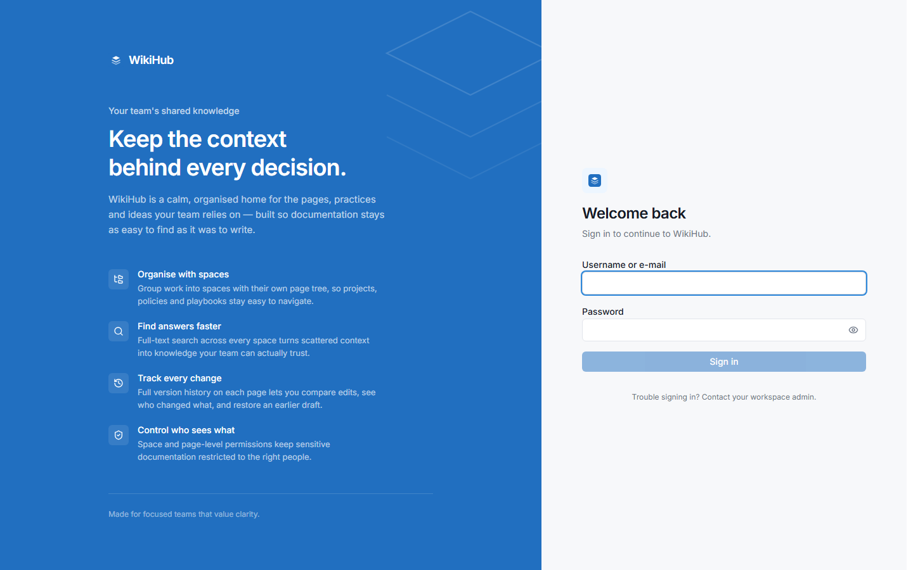
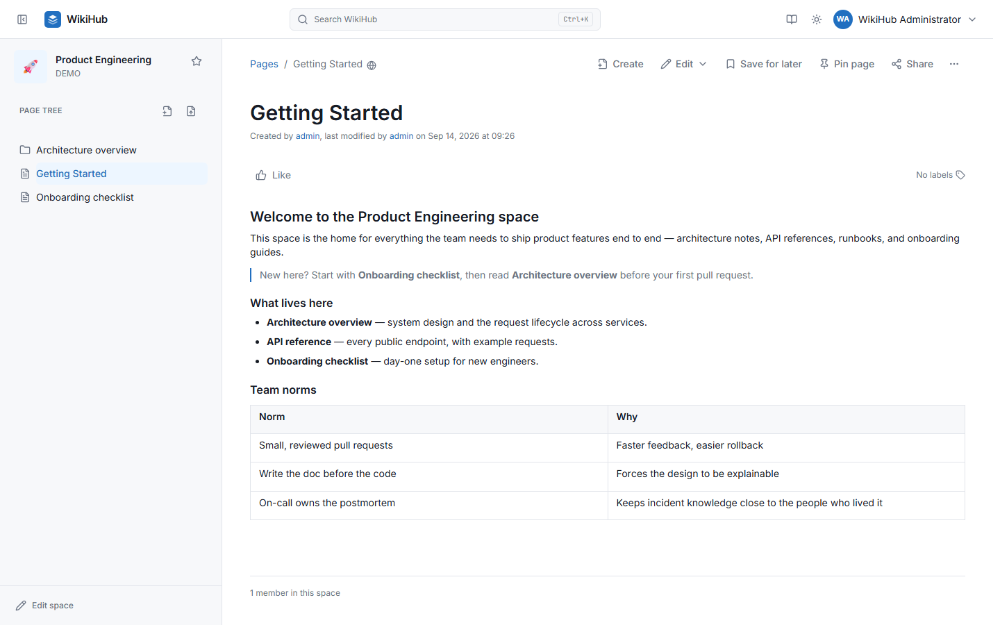
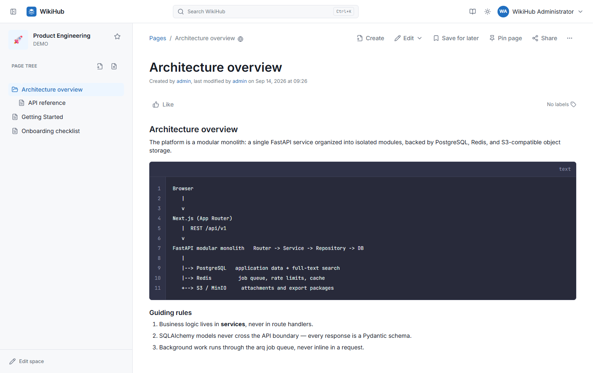
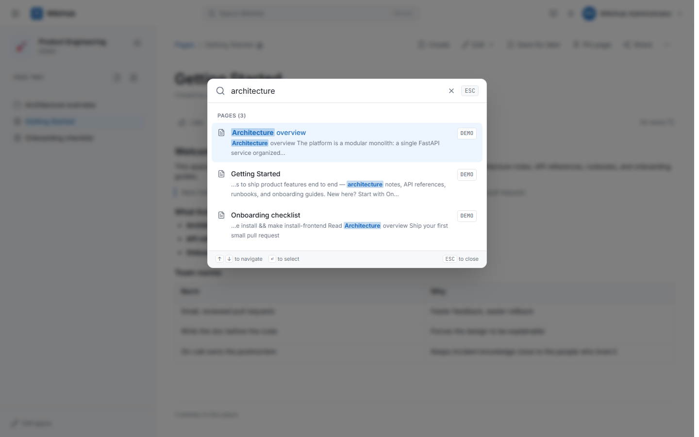
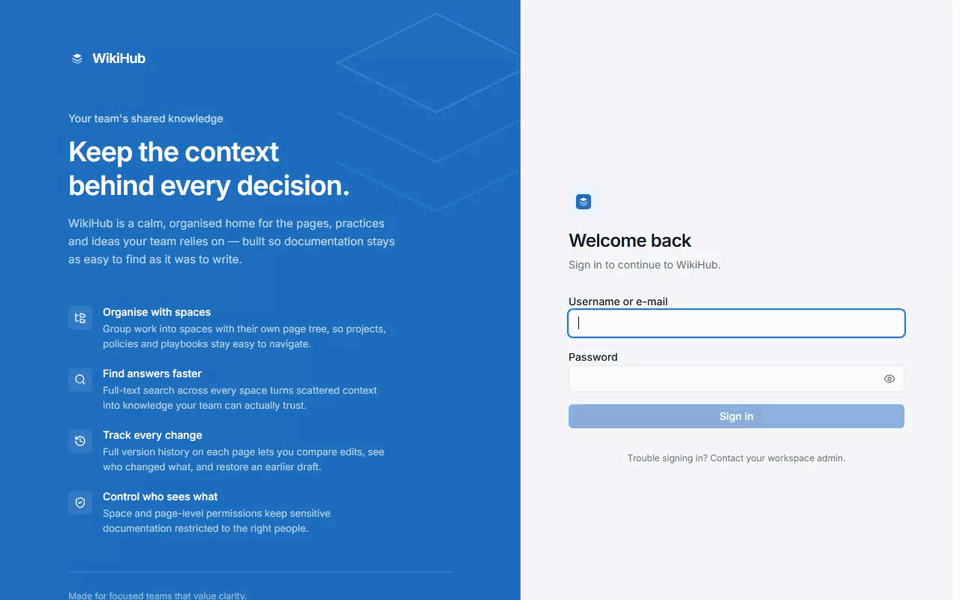
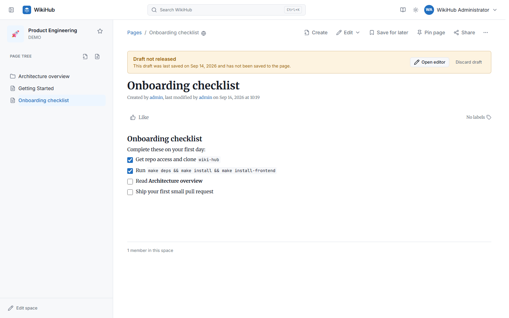
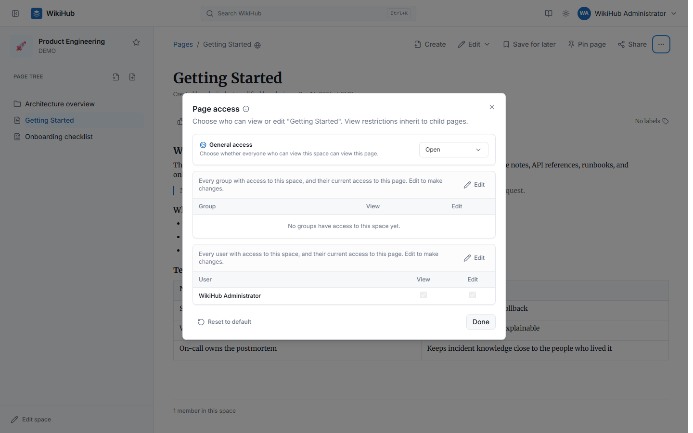
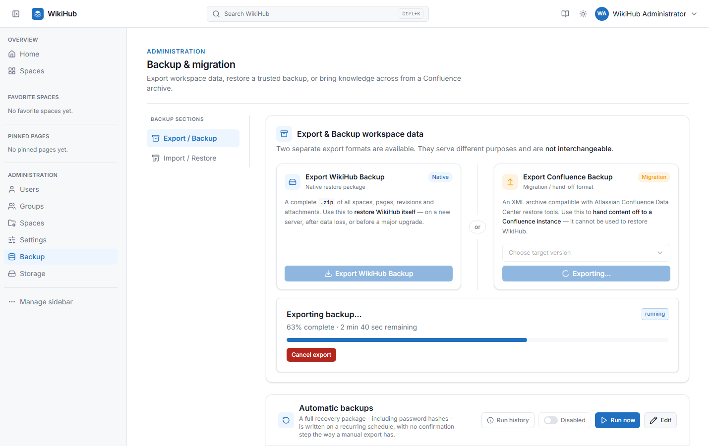
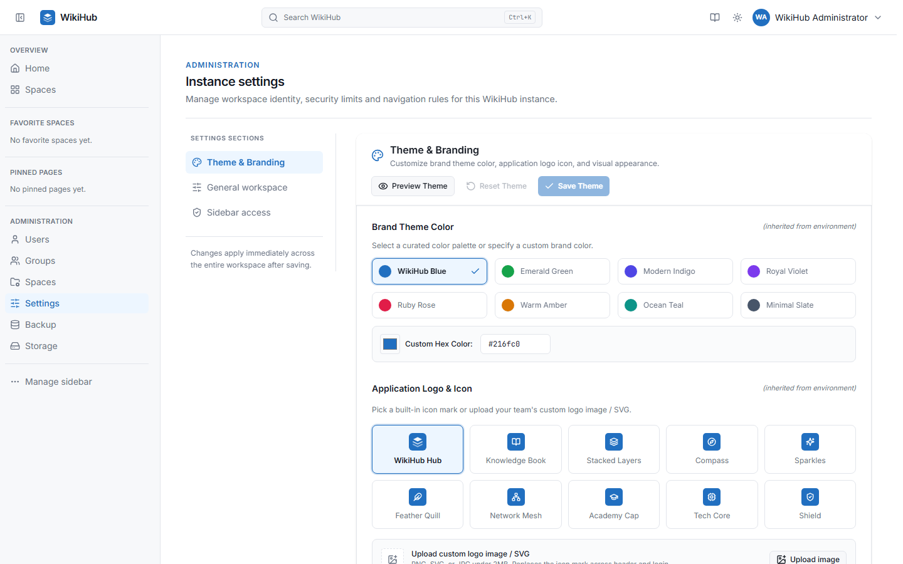
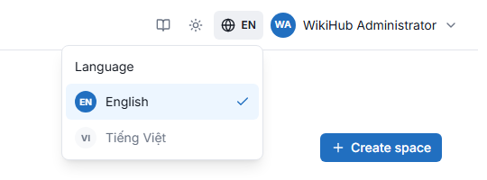

# WikiHub — Demo & Screenshots

A closer look at WikiHub than the [main README](../../README.md#-demo) has room
for. Every image below is a real, unedited capture of a running local
instance — nothing here is a mockup.

- [Signing in](#signing-in)
- [Editing a page](#editing-a-page)
- [A page, rendered](#a-page-rendered)
- [Code blocks](#code-blocks)
- [Global search](#global-search)
- [Likes, pins & saved-for-later](#likes-pins--saved-for-later)
- [Drafts & recovery](#drafts--recovery)
- [Permissions & access control](#permissions--access-control)
- [Backup & migration](#backup--migration)
- [Theme & branding](#theme--branding)
- [Language switching](#language-switching)
- [Small screens](#small-screens)

## Signing in

The sign-in screen carries whatever brand color and logo an administrator has
configured under **Administration → Settings → Theme & Branding** (see
[Theme & branding](#theme--branding) below) — this is the default WikiHub Blue
palette.

## Editing a page

The full path, start to finish: **sign in** → **Home** (the personal
activity feed, on its "My activity" tab) → jump into a space via **global
search** → open a page from its **page tree** → **Edit** → place the cursor
at the end, type `/callout` to open the slash-command menu, pick
**Callout**, and type into it → **Save**. The green toast in the last frame
is the real save confirmation, not staged for the recording.

The same `/` menu inserts headings, tables, code blocks, images, to-do lists,
toggles, dividers, and links to other pages — see the in-app **Help** center
for the full command reference.

## A page, rendered

A typical page: headings, a blockquote-style callout, a bulleted list, and a
data table, all in the same document. The page tree on the left reflects the
space's hierarchy — pages can be nested arbitrarily deep and moved anywhere,
including into a different space.

## Code blocks

Code blocks get syntax highlighting, line numbers, a language label, and a
one-click copy button — useful for runbooks, architecture notes, and anything
else that mixes prose with real code or config.

## Global search

`Ctrl`/`⌘` + `K` from anywhere in the app opens global search. It matches
against space names/keys/descriptions and page titles/content, highlights the
matched term in context, and only ever shows results the signed-in user has
permission to see.

## Likes, pins & saved-for-later

Three lightweight, independent ways to keep track of pages that matter:

- **Like** flags a page as useful — the count is visible to everyone.
- **Save for later** bookmarks a page for yourself; everything you've saved
  is listed at `/saved`. This one lives in your browser, not your account.
- **Pin page** adds it to **Pinned pages** in the space sidebar, so it's one
  click away every time you open that space.

## Drafts & recovery

Publishing a page and merely having unsaved changes are two different things.
While editing, an auto-saved draft is kept on the server separately from the
published content — if you navigate away or close the tab before hitting
**Save**, coming back to the page shows this banner instead of silently
losing the edit: **Open editor** resumes exactly where you left off, or
**Discard draft** throws it away and keeps the page as currently published.

## Permissions & access control

Access can be scoped at the space level or narrowed further on a single page.
**Page access** shows **General access** (Open or Restricted) plus exactly
which groups and users can view or edit *this* page — Restricted starts from
an empty allow-list you build up by adding specific people or groups, and
view restrictions inherit down to child pages. The same model, with the full
permission set (`View`, `Add/Edit`, `Delete`, `Delete own`, `Restrictions`,
`Move`, `Admin`), applies at the space level under
**Administration → Spaces → *space* → Access**, which also has an
**Effective permissions** checker that resolves exactly what any one person
can do without cross-referencing groups by hand.

## Backup & migration

Two export formats, side by side: a native **WikiHub Backup** `.zip` that can
restore WikiHub itself, and a **Confluence Backup** XML archive for handing
content off to a real Confluence Data Center instance (one-way — it cannot
restore WikiHub). Both run as trackable background jobs with a live progress
bar and a cancel button. Below them, **Automatic backups** runs a recurring
WikiHub backup on a schedule with no one needing to click anything.

## Theme & branding

Administrators can pick a curated color palette or a custom hex color, choose
a logo preset or upload a custom one, and preview both light and dark mode
before saving — changes apply instantly across the whole workspace once saved.

## Language switching

The **EN**/**VI** badge in the top bar switches the whole interface between
English and Vietnamese — every label, button, toast, and validation message
comes from the same translation dictionary, so nothing is left half-translated.
The choice is per-browser (cookie + `localStorage`, no account setting or
server round-trip) and applies instantly, without a page reload — anything
mid-edit in the page editor survives the switch untouched.

## Small screens

The exact same sign-in → Home → space → page → edit → save flow as
[Editing a page](#editing-a-page) above, at a real phone width (360×780,
Galaxy S24 - the closest class Playwright ships a device preset for to a
Galaxy S23 Ultra) rather than a scaled-down desktop layout. The space's own
page tree doesn't get an off-canvas drawer at this width yet, so it stays
visible above the page content instead of tucking behind a menu button.

---

Want to try it yourself? The [main README](../../README.md#-getting-started)
has the two-command Docker Compose quick start.
